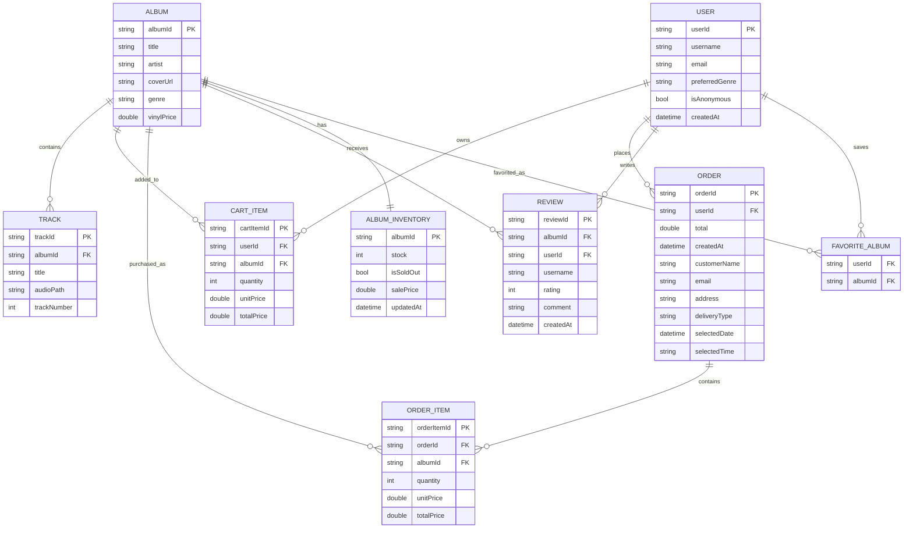
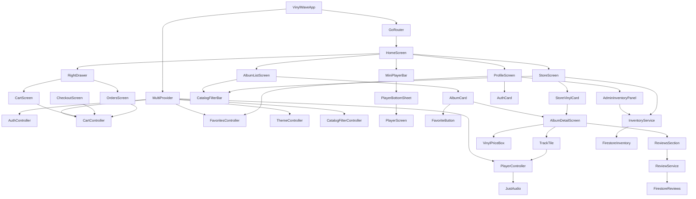
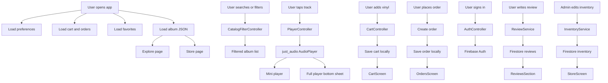

# VinylWave

VinylWave is a Flutter music player and vinyl store application based on the concepts from *Flutter Apprentice*.  
The app was adapted from the book’s recipe/restaurant project into a music and e-commerce project using BTS discography as sample data.

Users can explore albums, play real audio tracks, favorite albums, search and filter the catalog, buy vinyl records, place orders, write reviews, and sign in with Firebase Authentication. Admin users can also manage vinyl stock, sale prices, and sold-out status through Firebase Firestore.

---

## Project Overview

VinylWave combines two app ideas in one project:

1. **Music Player App**
   - Browse albums
   - View album details
   - Play real audio tracks
   - Use a mini player
   - Open the full player from a bottom sheet
   - Control playback, volume, and progress

2. **Vinyl Seller App**
   - Browse vinyl records
   - Add albums to cart
   - Checkout with delivery or pickup
   - Select date and time
   - View saved orders
   - Manage favorites
   - Admin inventory management

---

## Main Features

### Authentication

VinylWave supports Firebase Authentication:

- Sign up with email and password
- Sign in with email and password
- Continue as guest
- Sign out
- Admin role based on email

Admin users can access the Admin Inventory Panel from the Profile screen.

---

### Explore Page

The Explore page shows the BTS album catalog.

Features:

- Featured albums
- New vinyl arrivals
- Genres section
- Full discography
- Album cards
- Navigation to album detail page
- Smart search and filtering

Users can search by:

- Album title
- Artist name
- Genre
- Track title

Users can also:

- Filter by genre
- Sort by title
- Sort by price low to high
- Sort by price high to low
- Reset filters

---

### Store Page

The Store page is the vinyl shopping section.

Features:

- Vinyl album grid
- Local album cover assets
- Search and filter
- Price display
- Sale price display
- Stock display
- Sold-out overlay
- Add to cart button
- Cart and Orders buttons above the bottom navigation

Admin inventory data comes from Firestore, so the store updates when the admin changes stock or sale price.

---

### Album Detail Page

Each album has a detail page.

Features:

- Album cover
- Album title, artist, genre, and price
- Track list
- Tap a track to play real audio
- Add vinyl to cart
- Favorite album
- Reviews section
- Related vinyl section

---

### Real Music Player

The app uses `just_audio` for real audio playback.

Features:

- Play local audio assets
- Pause and resume
- Seek through track
- Volume control
- Display current position and duration
- Mini player above bottom navigation
- Full player opens from bottom to top using a modal bottom sheet

Audio files are stored locally in:

```text
assets/audio/
````

---

### Mini Player

The mini player appears above the bottom navigation bar.

It displays:

* Current track title
* Current album title
* Play/pause icon

When tapped, it opens the full player from the bottom of the screen.

---

### Cart

The cart is opened from the right side drawer.

Features:

* View cart items
* Increase quantity
* Decrease quantity
* Remove item
* View subtotal
* Go to checkout

Cart data is saved locally with `SharedPreferences`.

---

### Checkout

Checkout was improved to match the interactive checkout functionality from the book.

Features:

* Delivery / Pickup segmented control
* Contact name input
* Email input
* Address input for delivery
* Date picker
* Time picker
* Order summary
* Place order button

Orders are saved locally and can be viewed later.

---

### Orders

Orders are opened from the right side drawer.

Features:

* View previous orders
* View order items
* View customer information
* View delivery type
* View selected date and time
* View total price

---

### Favorites

Users can favorite albums.

Features:

* Favorite button on album cards
* Save favorite albums locally
* View favorite albums in Profile
* Remove albums from favorites by tapping the heart again

Favorites are saved using `SharedPreferences`.

---

### Reviews

VinylWave uses Firebase Cloud Firestore for album reviews.

Features:

* Signed-in users can write reviews
* Users can select rating
* Reviews are saved in Firestore
* Reviews are displayed with `StreamBuilder`
* Reviews update live

Firestore structure:

```text
albums
  albumId
    reviews
      reviewId
        albumId
        userId
        username
        rating
        comment
        createdAt
```

---

### Admin Inventory Panel

Admin users can manage vinyl inventory.

Admin can:

* Set stock quantity
* Mark albums as sold out
* Add sale price
* Save changes to Firestore

Firestore structure:

```text
album_inventory
  albumId
    stock
    isSoldOut
    salePrice
    updatedAt
```

The Store page listens to inventory updates and changes the UI automatically.

---

## Bottom Navigation Structure

The app uses only three main tabs:

```text
Explore
Store
Profile
```

Other screens are opened differently:

```text
Player -> bottom sheet from bottom to top
Cart -> right side drawer
Orders -> right side drawer
```

This creates a layout similar to real music apps.

---

## Project Structure

```text
lib/
  data/
    sample_albums.dart
    database/              # reserved for possible future database work

  models/
    album.dart
    track.dart
    cart_item.dart
    order.dart
    album_review.dart
    album_inventory.dart
    explore_data.dart

  routing/
    app_router.dart

  screens/
    album_detail_screen.dart
    album_list_screen.dart
    cart_screen.dart
    checkout_screen.dart
    home_screen.dart
    not_found_screen.dart
    album_not_found_screen.dart
    orders_screen.dart
    player_screen.dart
    profile_screen.dart
    store_screen.dart

  services/
    album_service.dart
    network_album_service.dart
    album_repository.dart
    album_repository_provider.dart
    mock_music_service.dart
    preferences_service.dart
    review_service.dart
    inventory_service.dart
    app_config.dart

  state/
    auth_controller.dart
    cart_controller.dart
    catalog_filter_controller.dart
    favorites_controller.dart
    player_controller.dart
    theme_controller.dart

  theme/
    app_theme.dart

  widgets/
    album_card.dart
    album_cover_image.dart
    admin_inventory_panel.dart
    catalog_filter_bar.dart
    compact_album_card.dart
    favorite_button.dart
    genre_card.dart
    horizontal_album_list.dart
    reviews_section.dart
    section_title.dart
    track_tile.dart
    vinyl_price_box.dart

assets/
  data/
    albums.json

  images/
    album cover images

  audio/
    local audio files
```

---

## Technologies Used

### Flutter

Used for building the cross-platform app UI.

### Dart

Main programming language.

### Provider

Used for state management.

Controllers:

* `AuthController`
* `CartController`
* `FavoritesController`
* `PlayerController`
* `ThemeController`
* `CatalogFilterController`

### GoRouter

Used for navigation and deep links.

Routes include:

```text
/
 /store
 /profile
 /album/:id
 /checkout
```

### Firebase Authentication

Used for:

* Email/password sign up
* Email/password sign in
* Anonymous guest login
* Sign out

### Firebase Cloud Firestore

Used for:

* Album reviews
* Admin inventory management

### SharedPreferences

Used for local persistence:

* Cart
* Orders
* Favorites
* Theme preference
* Volume
* Autoplay
* Preferred genre

### just_audio

Used for real audio playback from local assets.

### HTTP

Used for optional remote album JSON loading.

---

## Assets

The project uses local assets for stable images and audio.

### Album Covers

Stored in:

```text
assets/images/
```

Example:

```text
assets/images/proof.jpg
assets/images/wings.jpg
assets/images/be.png
```

### Audio Files

Stored in:

```text
assets/audio/
```

Example:

```text
assets/audio/yet_to_come.mp3
assets/audio/run_bts.mp3
assets/audio/fake_love.mp3
assets/audio/dynamite.mp3
assets/audio/no_more_dream.mp3
```

### JSON Data

Stored in:

```text
assets/data/albums.json
```

Example album format:

```json
{
  "id": "proof",
  "title": "Proof",
  "artist": "BTS",
  "coverUrl": "assets/images/proof.jpg",
  "genre": "Anthology",
  "vinylPrice": 49.99,
  "tracks": [
    {
      "title": "Yet To Come",
      "audioPath": "assets/audio/yet_to_come.mp3"
    },
    {
      "title": "Run BTS",
      "audioPath": "assets/audio/run_bts.mp3"
    }
  ]
}
```

---

## pubspec.yaml Assets Setup

The app requires these asset paths:

```yaml
flutter:
  uses-material-design: true

  assets:
    - assets/data/albums.json
    - assets/images/
    - assets/audio/
```

---

## Firebase Setup

The project uses Firebase for authentication, reviews, and inventory.

Required Firebase services:

```text
Authentication
Cloud Firestore
```

### Authentication Providers

Enable these in Firebase Console:

```text
Email/Password
Anonymous
```

### Firestore Collections

```text
albums
  albumId
    reviews
      reviewId

album_inventory
  albumId
```

### Example Firestore Rules for Testing

```text
rules_version = '2';

service cloud.firestore {
  match /databases/{database}/documents {
    match /{document=**} {
      allow read, write: if request.auth != null;
    }
  }
}
```

For production, admin writes should be restricted.

---

## Admin Mode

Admin emails are configured in:

```text
lib/services/app_config.dart
```

Example:

```dart
class AppConfig {
  static const String? remoteAlbumsUrl = null;

  static const List<String> adminEmails = [
    'a.kazbek@internet.ru',
  ];
}
```

Only users signed in with an admin email can see the Admin Panel.

---

## ER Diagram



---

## Widget and Function Relationship Diagram



---

## Function Flow Diagram



---

## Book Chapter Mapping

This project follows and adapts the main chapters from *Flutter Apprentice*.

| Chapter    | Book Topic                   | VinylWave Implementation                   |
| ---------- | ---------------------------- | ------------------------------------------ |
| Chapter 1  | Flutter setup                | Flutter project setup                      |
| Chapter 2  | First app, list, detail page | Album list and album detail                |
| Chapter 3  | Basic widgets and themes     | App theme, cards, buttons, app bar         |
| Chapter 4  | Understanding widgets        | Stateless and Stateful widgets             |
| Chapter 5  | Scrollable widgets           | ListView, horizontal lists, FutureBuilder  |
| Chapter 6  | Advanced scrollables         | Slivers, GridView, responsive store        |
| Chapter 7  | Interactive widgets          | Cart, checkout, date picker, time picker   |
| Chapter 8  | Routes and navigation        | GoRouter routes                            |
| Chapter 9  | Deep links and web URLs      | `/album/:id` deep links                    |
| Chapter 10 | SharedPreferences            | Theme, volume, autoplay, genre             |
| Chapter 11 | JSON serialization           | Album and Track JSON parsing               |
| Chapter 12 | Networking                   | NetworkAlbumService with fallback          |
| Chapter 13 | State management             | Provider controllers                       |
| Chapter 14 | Streams                      | Audio player streams and Firestore streams |
| Chapter 15 | Saving data locally          | SharedPreferences JSON persistence         |
| Chapter 16 | Firebase Firestore           | Auth, reviews, admin inventory             |
| Chapter 17 | Unit testing                 | Model and controller tests                 |
| Chapter 18 | Widget testing               | Widget tests for UI components             |

Chapters 19–21 are deployment chapters and are not included in this version.

---

## Testing

The project includes unit and widget tests.

### Unit Tests

Examples:

```text
test/models/album_test.dart
test/models/track_test.dart
test/state/cart_controller_test.dart
```

Tested logic:

* Album JSON parsing
* Track JSON parsing
* Cart add/remove logic
* Quantity calculation
* Subtotal calculation
* Order creation

### Widget Tests

Examples:

```text
test/widgets/album_card_test.dart
test/widgets/track_tile_test.dart
test/widgets/cart_screen_test.dart
```

Tested UI:

* AlbumCard displays album data
* AlbumCard tap works
* TrackTile displays track data
* TrackTile tap works
* CartScreen empty state works

Run tests:

```bash
flutter test
```

---

## How to Run the Project

### 1. Clone the repository

```bash
git clone https://github.com/YOUR_USERNAME/vinyl_wave.git
cd vinyl_wave
```

### 2. Install dependencies

```bash
flutter pub get
```

### 3. Check assets

Make sure these folders exist:

```text
assets/data/
assets/images/
assets/audio/
```

### 4. Run on Chrome

```bash
flutter run -d chrome
```

### 5. Run on emulator/device

```bash
flutter run
```

---

## Firebase Configuration

The project needs a Firebase configuration file:

```text
lib/firebase_options.dart
```

If the file is missing, run:

```bash
flutterfire configure
```

For web-only setup, you can run:

```bash
flutterfire configure --platforms=web
```

---

## Important Notes About Audio

The app plays audio from local assets.

Audio files must be legal to use. For school/demo purposes, use:

```text
short preview clips
royalty-free music
your own recordings
public demo audio
```

Do not distribute copyrighted full songs without permission.

---

## Important Notes About Album Covers

Album covers are local image assets.

Make sure the filenames in `albums.json` exactly match the files inside:

```text
assets/images/
```

Example:

```json
"coverUrl": "assets/images/proof.jpg"
```

Flutter asset paths are case-sensitive.

---

## Main Controllers

### AuthController

Handles Firebase authentication.

Main methods:

```text
signUpWithEmail()
signInWithEmail()
signInAnonymously()
signOut()
isAdmin
```

### CartController

Handles cart and orders.

Main methods:

```text
loadSavedData()
addAlbum()
decreaseAlbum()
removeAlbum()
clearCart()
createOrder()
```

### FavoritesController

Handles favorite albums.

Main methods:

```text
loadFavorites()
toggleFavorite()
isFavorite()
```

### PlayerController

Handles audio playback.

Main methods:

```text
setTrack()
togglePlayPause()
seek()
updateVolume()
updateAutoplay()
```

### CatalogFilterController

Handles smart search and filtering.

Main methods:

```text
updateSearchQuery()
updateGenre()
updateSortOption()
resetFilters()
applyFilters()
```

---

## Main Services

### AlbumService

Loads albums from local JSON.

### NetworkAlbumService

Loads albums from remote JSON using HTTP.

### AlbumRepository

Decides whether to use remote data or local fallback.

### PreferencesService

Saves small user preferences.

### ReviewService

Handles Firestore album reviews.

### InventoryService

Handles Firestore admin inventory.

---

## Screenshots to Add

Add screenshots to your repository later:

```text
screenshots/explore.png
screenshots/store.png
screenshots/player.png
screenshots/cart.png
screenshots/checkout.png
screenshots/profile.png
screenshots/admin.png
```

Then include them like this:

```markdown
## Screenshots

### Explore


### Store


### Player


### Admin Panel

```

---

## Future Improvements

Possible improvements:

* Playlist builder
* Recently played tracks
* Firestore order sync
* Better admin role security using custom claims
* Real remote album database
* Push notifications for sale prices
* Full order status tracking
* Golden tests for visual regression
* Android/iOS release builds

---

## Author

Created by **Aigerim Kazbek**.

Project theme: **Music player + vinyl seller app**
Sample data theme: **BTS discography**

---

## License and Disclaimer

This project was created for educational purposes.

The app uses BTS-related sample data as a project theme.
Any album images, names, or music files should only be used if you have permission or if they are allowed for educational/demo use.

Do not distribute copyrighted full songs or protected images without permission.

```
```
